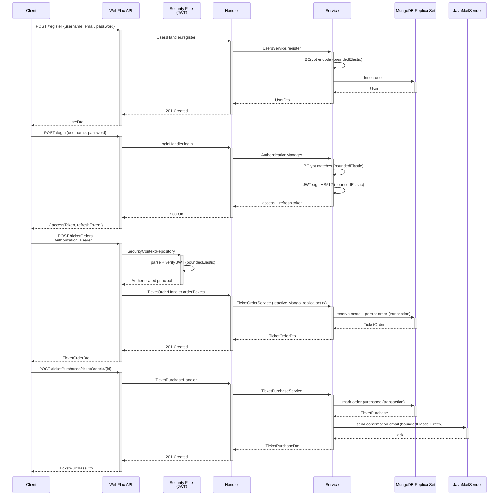
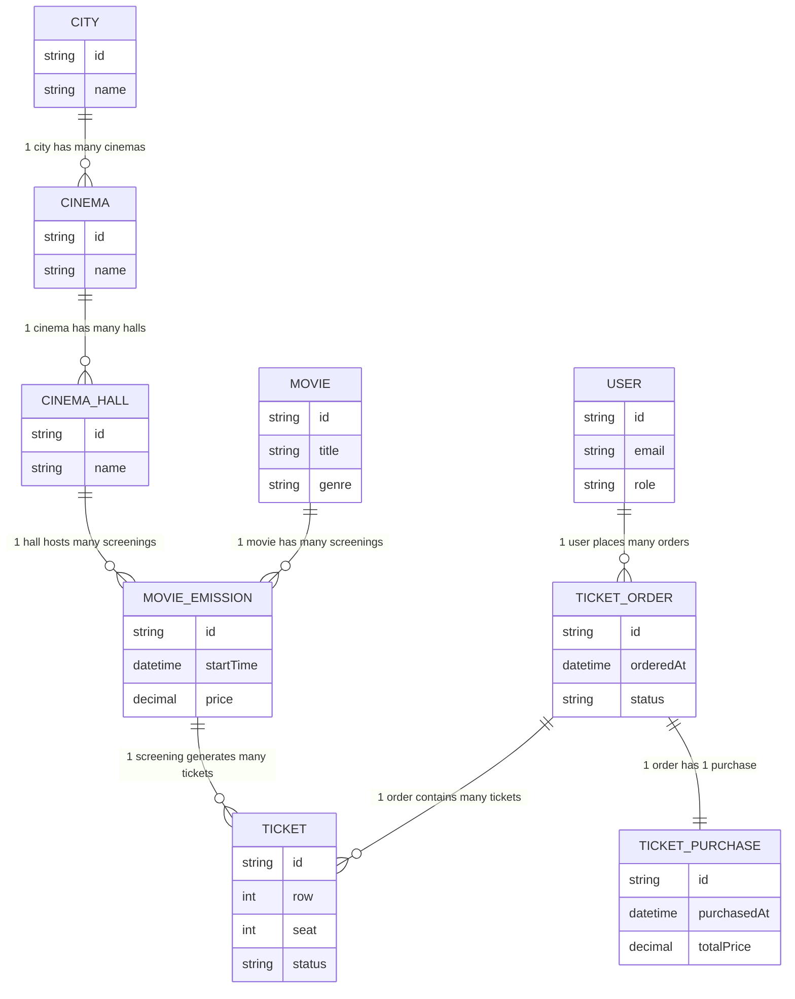
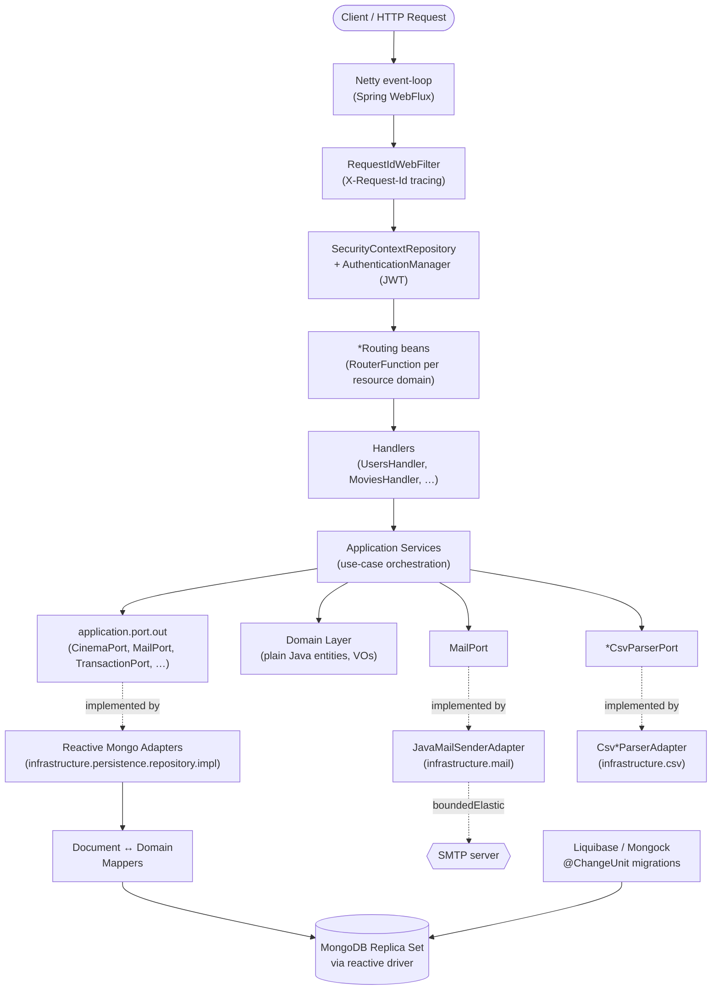
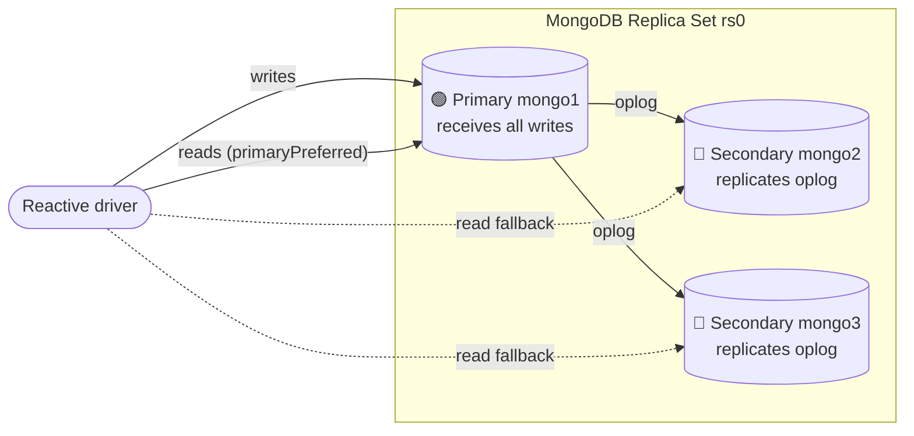
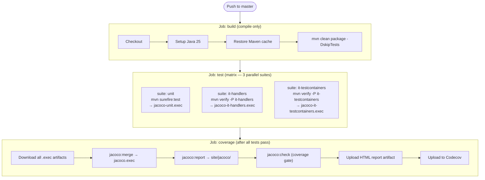

# Reactive RESTful API – Cinema Ticketing Platform (Spring WebFlux)

[](https://spring.io/projects/spring-boot)
[](https://openjdk.org/)
[](https://docs.spring.io/spring-framework/reference/web/webflux.html)
[](https://www.mongodb.com/)
[](https://www.docker.com/)
[](https://opensource.org/licenses/MIT)

> **Archived project.** Originally built as a learning exercise on Spring Boot 2.4.4 / Java 17, then iteratively migrated up to **Spring Boot 4.0.5 / Java 25** and refactored into a hexagonal / DDD-inspired layout. Kept on this baseline for reference and portfolio purposes — see [Migration History](#migration-history) for the full path.

<a id="toc"></a>
## Table of Contents

- [Overview](#overview)
- [How It Works](#how-it-works)
- [Business Domain](#business-domain)
- [Role-Based Access Control](#role-based-access-control)
- [API Endpoints](#api-endpoints)
- [Getting Started](#getting-started)
- [Environment Variables](#environment-variables)
- [Architecture](#architecture)
- [MongoDB Replica Set](#mongodb-replica-set)
- [Non-Blocking Integrations](#non-blocking-integrations)
- [Technical Highlights](#technical-highlights)
- [Tech Stack](#tech-stack)
- [Testing](#testing)
- [CI Pipeline](#ci-pipeline)
- [Observability](#observability)
- [Repository Structure](#repository-structure)
- [Why Reactive?](#why-reactive)
- [Migration History](#migration-history)
- [Contact](#contact)

---

<a id="overview"></a>
## Overview

[↑ Back to top](#toc)

A reactive REST API for a **cinema ticketing system** — a backend platform that manages a network of cinemas and the full ticket purchasing flow (browse cities → cinemas → screenings → seats → order → purchase). The full I/O pipeline is non-blocking: **Spring WebFlux** routing on Netty, **reactive MongoDB driver** with a 3-node replica set for distributed transactions, and JWT-based authentication. No blocking thread is ever held during a request — every CPU-bound or blocking call (BCrypt, JWT signing, CSV import, SMTP) is explicitly offloaded to `Schedulers.boundedElastic()`.

The codebase follows a **hexagonal / DDD-inspired** layering: a `domain` layer with plain Java entities free of Spring/Mongo/Lombok annotations, an `application` layer that orchestrates use cases against `port/out` interfaces (Reactor `Mono`/`Flux` types in method signatures), and an `infrastructure` layer with the reactive Mongo adapters, persistence documents (annotated with `@Document` / Lombok), security, AOP, and Mongock migrations. HTTP routing lives in a separate `presentation` layer based on functional `RouterFunction` + handler beans, with `@RouterOperations` annotations driving springdoc-openapi.

> **DDD status — be honest:** the domain package is genuinely free of Spring imports, Mongo annotations, and Lombok; persistence concerns are isolated in `infrastructure/persistence` (separate `*Document` classes + mappers + repository adapters). However, the application services still operate on Reactor types (`Mono`/`Flux`) directly rather than a framework-agnostic abstraction, so this is best described as **DDD-inspired hexagonal layering** rather than a textbook clean architecture.

---

<a id="how-it-works"></a>
## How It Works

[↑ Back to top](#toc)

End-to-end flow for the canonical use case — a registered user purchasing a ticket:



### Step-by-step

1. **Registration (`POST /register`)** — public endpoint. Password is hashed with BCrypt on `boundedElastic` so the Netty event-loop is never held by the ~50–100 ms hashing work.
2. **Login (`POST /login`)** — verifies credentials and issues a JWT access token (HS512) plus a refresh token. Both signing and verification run on `boundedElastic`.
3. **Authenticated requests** — every protected route is gated by a custom `SecurityContextRepository` + `AuthenticationManager` that parses the bearer token, validates it, and populates the reactive security context. Authorization is then enforced per route (see [Role-Based Access Control](#role-based-access-control)).
4. **Ticket ordering (`POST /ticketOrders`)** — reserves seats and persists the order inside a **MongoDB distributed transaction** (replica set required, see below). Idempotency and concurrency rules are enforced at the service layer.
5. **Ticket purchase (`POST /ticketPurchases/...`)** — finalises an existing order (or buys directly) inside a transaction, then triggers a confirmation email. SMTP is offloaded to `boundedElastic` with retries on transient failures.

---

<a id="business-domain"></a>
## Business Domain

[↑ Back to top](#toc)

A typical user journey: **browse cinemas in their city → pick a movie → find a screening → choose seats → place an order → complete the purchase.**

### Domain Model



The domain layer (`com.rzodeczko.domain`) is independent of Spring infrastructure — entities and value objects are plain Java without Spring/Mongo/Lombok annotations. Application services in `com.rzodeczko.application.service` orchestrate use cases against output ports defined in `com.rzodeczko.application.port.out`; routing handlers in `com.rzodeczko.presentation.routing.handlers` adapt them to HTTP. Persistence-shaped representations live in `com.rzodeczko.infrastructure.persistence.document` (`*Document` classes) and are mapped to/from domain entities by dedicated mappers.

---

<a id="role-based-access-control"></a>
## Role-Based Access Control

[↑ Back to top](#toc)

Authentication is JWT-based. Each user receives one of two roles after registration: **USER** or **ADMIN**. ADMIN can be granted by promoting an existing USER (`POST /users/promoteToAdmin/username/{username}`).

| Endpoint | Public | USER | ADMIN |
|---|:---:|:---:|:---:|
| `POST /register` | ✅ | | |
| `POST /login` | ✅ | | |
| `/docs`, `/v3/api-docs/**` (Swagger) | ✅ | | |
| `/actuator/health` | ✅ | | |
| `GET /cities/**` | | ✅ | |
| `GET /cinemas` | | ✅ | |
| `/movies/**` | | ✅ | ✅ |
| `/tickets/**` | | ✅ | |
| `/ticketOrders/**` | | ✅ | |
| `/ticketsOrders/**` | | ✅ | |
| `/ticketPurchases/**` | | ✅ | |
| `/movieEmissions/**` (read) | | ✅ | ✅ |
| `POST /emails/send/single` | | ✅ | ✅ |
| `/users/**` | | | ✅ |
| `/statistics/**` | | | ✅ |
| `/cinemas/**` (write) | | | ✅ |
| `POST /movieEmissions` | | | ✅ |
| `/admin/ticketPurchases/**` | | | ✅ |
| `POST /emails/send/multiple` | | | ✅ |
| `POST /cities/csv` (bulk import) | | | ✅ |
| `POST /cinemas/csv` (bulk import) | | | ✅ |
| `POST /cinemaHalls/cinemaId/{id}/csv` | | | ✅ |
| `POST /movies/csv` (bulk import) | | | ✅ |
| `POST /movieEmissions/csv` (bulk import) | | | ✅ |

---

<a id="api-endpoints"></a>
## API Endpoints

[↑ Back to top](#toc)

Base URL (local): `http://localhost:8080`. Authentication is performed via `Authorization: Bearer <accessToken>` (token returned by `POST /login`).

Routes are defined as functional `RouterFunction` beans across per-resource `*Routing` configuration classes in `com.rzodeczko.presentation.routing`. Highlights:

### Auth & Users

| Method | Path | Description | Roles |
|---|---|---|---|
| `POST` | `/register` | Create a new account | Public |
| `POST` | `/login` | Issue access + refresh JWTs | Public |
| `GET` | `/users` | List all users | ADMIN |
| `GET` | `/users/username/{username}` | Get user by username | ADMIN |
| `POST` | `/users/promoteToAdmin/username/{username}` | Grant ADMIN role | ADMIN |

### Cities, Cinemas, Halls

| Method | Path | Description | Roles |
|---|---|---|---|
| `POST` | `/cities` | Create city | ADMIN |
| `GET` | `/cities` | List cities | USER |
| `GET` | `/cities/name/{name}` | Find city by name | USER |
| `PUT` | `/cities` | Attach a cinema to a city | ADMIN |
| `POST` | `/cities/csv` | Bulk import from CSV | ADMIN |
| `POST` | `/cinemas` | Create cinema | ADMIN |
| `GET` | `/cinemas` | List cinemas | USER |
| `GET` | `/cinemas/city/{city}` | List cinemas in a city | USER |
| `PUT` | `/cinemas/id/{id}/addCinemaHall` | Add hall to cinema | ADMIN |
| `POST` | `/cinemas/csv` | Bulk import from CSV | ADMIN |
| `GET` | `/cinemaHalls` | List all halls | USER |
| `GET` | `/cinemaHalls/cinemaId/{cinemaId}` | List halls of a cinema | USER |
| `POST` | `/cinemaHalls/addToCinema/cinemaId/{cinemaId}` | Add hall | ADMIN |
| `POST` | `/cinemaHalls/cinemaId/{cinemaId}/csv` | Bulk import halls from CSV | ADMIN |

### Movies & Screenings

| Method | Path | Description | Roles |
|---|---|---|---|
| `GET` | `/movies` | List all movies | USER / ADMIN |
| `GET` | `/movies/id/{id}` | Get movie by id | USER / ADMIN |
| `POST` | `/movies` | Add a movie | ADMIN |
| `DELETE` | `/movies/id/{id}` | Delete a movie | ADMIN |
| `PATCH` | `/movies/addToFavorites/{id}` | Add to user's favorites | USER |
| `GET` | `/movies/favorites` | List user's favorites | USER |
| `GET` | `/movies/filter/premiereDate` | Filter by premiere date | USER / ADMIN |
| `GET` | `/movies/filter/duration` | Filter by duration | USER / ADMIN |
| `GET` | `/movies/filter/name/{name}` | Filter by name | USER / ADMIN |
| `GET` | `/movies/filter/genre/{genre}` | Filter by genre | USER / ADMIN |
| `GET` | `/movies/filter/keyword/{keyword}` | Full-text-ish keyword filter | USER / ADMIN |
| `POST` | `/movies/csv` | Bulk import from CSV (atomic) | ADMIN |
| `POST` | `/movieEmissions` | Schedule a screening | ADMIN |
| `GET` | `/movieEmissions` | List all screenings | USER / ADMIN |
| `GET` | `/movieEmissions/movieId/{movieId}` | Screenings of a movie | USER / ADMIN |
| `GET` | `/movieEmissions/cinemaHallId/{cinemaHallId}` | Screenings in a hall | USER / ADMIN |
| `DELETE` | `/movieEmissions/{id}` | Cancel a screening | ADMIN |
| `POST` | `/movieEmissions/csv` | Bulk import from CSV | ADMIN |

### Orders & Purchases

| Method | Path | Description | Roles |
|---|---|---|---|
| `POST` | `/ticketOrders` | Place a ticket order | USER |
| `PUT` | `/ticketsOrders/cancel/orderId/{orderId}` | Cancel an order | USER |
| `GET` | `/ticketsOrders/username` | List logged user's orders | USER |
| `POST` | `/ticketPurchases` | Buy a ticket directly | USER |
| `POST` | `/ticketPurchases/ticketOrderId/{id}` | Finalise an existing order | USER |
| `GET` | `/ticketPurchases` | Logged user's purchases | USER |
| `GET` | `/ticketPurchases/city/{city}` | …filtered by city | USER |
| `GET` | `/ticketPurchases/cinemaId/{cinemaId}` | …filtered by cinema | USER |
| `GET` | `/ticketPurchases/movieId/{movieId}` | …filtered by movie | USER |
| `GET` | `/admin/ticketPurchases` | All purchases | ADMIN |
| `GET` | `/admin/ticketPurchases/dates` | All purchases by date range | ADMIN |
| `GET` | `/admin/ticketPurchases/city/{city}` | All purchases by city | ADMIN |
| `GET` | `/admin/ticketPurchases/cinemaId/{cinemaId}` | …by cinema | ADMIN |
| `GET` | `/admin/ticketPurchases/cinemaHallId/{cinemaHallId}` | …by hall | ADMIN |
| `GET` | `/admin/ticketPurchases/movieId/{movieId}` | …by movie | ADMIN |

### Email & Statistics

| Method | Path | Description | Roles |
|---|---|---|---|
| `POST` | `/emails/send/single` | Send email to self | USER / ADMIN |
| `POST` | `/emails/send/multiple` | Send batch to multiple recipients | ADMIN |
| `GET` | `/statistics/cities/cinemaFrequency` | Cinema count per city | ADMIN |
| `GET` | `/statistics/cities/cinemaFrequency/max` | City with most cinemas | ADMIN |
| `GET` | `/statistics/movies/mostPopular/byCity` | Most popular movie per city | ADMIN |
| `GET` | `/statistics/movies/frequency` | Per-movie ticket frequency | ADMIN |
| `GET` | `/statistics/movies/mostPopularGroupedByGenre/byCity/{city}` | Top movies per genre in a city | ADMIN |
| `GET` | `/statistics/averageTicketPrice` | Average ticket price per city | ADMIN |

> Browse the full, interactive contract at **[Swagger UI](#openapi--swagger-ui)** once the application is running.

---

<a id="getting-started"></a>
## Getting Started

[↑ Back to top](#toc)

### Prerequisites

- **Docker** and **Docker Compose v2**
- **Java 25** + **Maven 3.9+** _(only if running outside containers)_

### 1. Provide environment variables

The repository ships with a `.env.sample` template listing every variable that `docker-compose.yml` and `application.yml` consume. Copy it to `.env` next to `docker-compose.yml` and fill in real values:

```bash
cp .env.sample .env
# then edit .env and replace the placeholder values
```

The `.env` file **must** sit next to `docker-compose.yml` (Compose loads it automatically from the project root) and **must not** be committed — it is already covered by `.gitignore`.

Required variables (see `.env.sample`):

- `MAIL_USERNAME`, `MAIL_PASSWORD` — SMTP credentials used by `JavaMailSender` (Gmail app password by default).
- `ADMIN_USERNAME`, `ADMIN_PASSWORD` — bootstrap admin account injected into `application.yml`.
- `MONGO1_HOST_PORT`, `MONGO2_HOST_PORT`, `MONGO3_HOST_PORT` — host ports published for the three Mongo replica-set nodes.

> The default SMTP host (`smtp.gmail.com`) is configured in `application.yml`. Override it there if you don't want to use Gmail.

### 2. Build the application

```bash
mvn clean package -DskipTests
```

The `maven-dependency-plugin` `unpack` execution prepares `target/dependency/` for the layered Docker image.

### 3. Start the stack

```bash
docker compose up -d --build
```

This brings up:
- `mongo1`, `mongo2`, `mongo3` — three-node MongoDB 8.3.1 replica set
- `mongo-init` — one-shot bootstrap container that waits for all three nodes, then runs `rs.initiate(...)` on `mongo1` if the replica set is not yet configured
- `liquibase-mongo` — runs Mongock/Liquibase migrations against the replica set; starts only after `mongo-init` completes successfully
- `app` — the WebFlux service; starts only after `liquibase-mongo` completes successfully

### 4. Verify

| Resource | URL |
|----------|-----|
| API | `http://localhost:8080` |
| Swagger UI | `http://localhost:8080/docs` |
| OpenAPI JSON | `http://localhost:8080/v3/api-docs` |
| Actuator health | `http://localhost:8080/actuator/health` |

A quick smoke check:

```bash
# Replica set is healthy
docker exec -it mongo1 mongosh --port 30001 --eval "rs.status().ok"

# API up — Spring Boot Actuator health endpoint
curl -i http://localhost:8080/actuator/health

# OpenAPI document is being served
curl -s http://localhost:8080/v3/api-docs | head -c 200
```

The application exposes Spring Boot Actuator with only the `health` endpoint enabled (`management.endpoints.web.exposure.include: health` in `application.yml`); a healthy response returns HTTP `200` with `{"status":"UP"}`. The `app` service also defines a Docker Compose healthcheck that calls the same endpoint with `wget` every 15 seconds, waits up to 5 seconds, retries 5 times, and gives the application a 60-second start period.

---

<a id="openapi--swagger-ui"></a>
### OpenAPI / Swagger UI

Interactive API documentation is generated by **springdoc-openapi WebFlux** and served at:

```
http://localhost:8080/docs
```

Each `*Routing` configuration class annotates its `@Bean` method with `@RouterOperations`, mapping every route to its handler method. Handler methods carry `@Operation`, `@ApiResponses`, and `@SecurityRequirement` annotations from the OpenAPI spec, which springdoc picks up automatically — there is no extra controller layer.

---

<a id="environment-variables"></a>
## Environment Variables

[↑ Back to top](#toc)

A `.env.sample` file at the repository root lists every variable the stack expects. Copy it to `.env` (next to `docker-compose.yml`) and fill in real values; the `.env` file is git-ignored and must never be committed.

| Variable | Required | Description |
|----------|----------|-------------|
| `MAIL_USERNAME` | yes | SMTP username consumed by `application.yml` (`spring.mail.username`) |
| `MAIL_PASSWORD` | yes | SMTP password used by `JavaMailSender` (Gmail app password by default) |
| `ADMIN_USERNAME` | yes | Bootstrap admin account injected into `application.yml` |
| `ADMIN_PASSWORD` | yes | Bootstrap admin password |
| `MONGO1_HOST` | yes | Hostname for replica set node 1 (used in both Compose and `application.yml`) |
| `MONGO2_HOST` | yes | Hostname for replica set node 2 |
| `MONGO3_HOST` | yes | Hostname for replica set node 3 |
| `MONGO_PORT` | yes | In-container port for all three Mongo nodes |
| `MONGO1_HOST_PORT` | yes | Host port published for `mongo1` |
| `MONGO2_HOST_PORT` | yes | Host port published for `mongo2` |
| `MONGO3_HOST_PORT` | yes | Host port published for `mongo3` |
| `MONGO_DB_NAME` | yes | MongoDB database name |
| `RS_NAME` | yes | Replica set name (e.g. `rs0`) |
| `JWT_SECRET_KEY` | yes | HS512 signing key for JWT tokens |
| `APP_PORT` | yes | Port on which the Spring Boot application listens |

Application-level configuration (Mongo URI, JWT lifetimes, springdoc paths, Liquibase changelog, Actuator exposure) lives in `src/main/resources/application.yml`. Override via standard Spring Boot mechanisms (env vars, `--spring.config.additional-location`, etc.).

---

<a id="architecture"></a>
## Architecture

[↑ Back to top](#toc)

The codebase follows a **hexagonal / DDD-inspired** layering with a strict dependency direction (`presentation → application → domain`, `infrastructure` provides adapters that implement application ports):



### Layer responsibilities

| Layer | Package | Responsibility |
|---|---|---|
| Presentation | `com.rzodeczko.presentation` | Map HTTP requests to application services; serialise responses; emit OpenAPI metadata. Routing is split across per-resource `*Routing` configuration classes, each extending `BaseJsonRouter`. Handler beans (`*Handler`) contain the request/response logic and carry `@Operation` / `@ApiResponses` annotations. |
| Application | `com.rzodeczko.application.{service,dto,mapper,port.out,validator,exception,security}` | Use-case orchestration, DTO ↔ domain mapping, input validation, output ports for infrastructure. Reactor `Mono`/`Flux` are used in port and service signatures. |
| Domain | `com.rzodeczko.domain.*` | Pure business model — entities, value objects, domain exceptions. **No Spring / Mongo / Lombok** imports. Entities are modelled as immutable Java records with "wither" methods; value objects (`Money`, `Discount`, `Position`) enforce their invariants in the canonical constructor. |
| Infrastructure | `com.rzodeczko.infrastructure.{persistence,security,mail,csv,aspect,openapi,transaction,config,web}` | Adapter implementations of application ports: reactive Mongo repositories, persistence `*Document` types (annotated with `@Document` + Lombok), security configuration, CSV parser adapters, Mongock migrations, AOP logging, HTTP filter. |

### Key infrastructure pieces

- **`*Routing` + `BaseJsonRouter`** — HTTP routes are defined across dedicated `@Configuration` classes (one per resource domain: `MoviesRouting`, `CinemasRouting`, `CitiesRouting`, etc.). Each class extends `BaseJsonRouter` (which provides shared `jsonAccept()` / `jsonContent()` predicates) and annotates its router `@Bean` with `@RouterOperations` to wire springdoc.
- **`SecurityContextRepository` + `AuthenticationManager`** — custom reactive components that decode the bearer JWT, validate it (signing key + expiration), and populate the security context. The 401 and 403 error responses are handled by dedicated `ServerAuthenticationEntryPoint` / `ServerAccessDeniedHandler` beans that log the real reason server-side (with request ID) but return only a generic message to the client.
- **`RequestIdWebFilter`** — runs at `Ordered.HIGHEST_PRECEDENCE`. On every incoming request it reads (or generates) an `X-Request-Id` UUID, stores it in exchange attributes, and echoes it in the response header. All security error handlers and `GlobalExceptionHandler` include it in every error body for client-side correlation.
- **`PasswordEncoderConfig`** — extracted to break the circular dependency that arose from defining `PasswordEncoder` inside `WebSecurityConfig` during the Spring Security 6 migration.
- **`SpringPasswordEncoderAdapter`** — implements the `PasswordEncoderPort` so the application layer never depends on Spring Security's `PasswordEncoder` directly.
- **Liquibase / Mongock 5** — schema migrations applied via a dedicated `liquibase-mongo` Compose service that runs Liquibase changesets defined under `db/changelog/`. Migration units in `infrastructure/persistence/initscripts` use Mongock's `@ChangeUnit` API.
- **Reactive Mongo with replica-set transactions** — `TicketOrderService` and `TicketPurchaseService` use a `TransactionPort` (implemented by a `TransactionalOperator`-backed adapter in `infrastructure.transaction`) to atomically reserve seats / mark orders purchased.
- **`infrastructure/csv/`** — five `Csv*ParserAdapter` classes implement the corresponding `*CsvParserPort` interfaces. Parsing runs inside `Mono.fromCallable(...)` on `Schedulers.boundedElastic()` (OpenCSV is synchronous/blocking). Row-level validation errors are collected during parsing and surfaced together before any write is attempted.

> The Docker image is **layered** for fast incremental builds: Maven's `maven-dependency-plugin unpack` splits the fat JAR into a cached _dependencies_ layer and a small _classes_ layer that changes per build.

---

<a id="mongodb-replica-set"></a>
## MongoDB Replica Set

[↑ Back to top](#toc)

The application relies on **MongoDB distributed transactions**, which require a replica set (a single standalone `mongod` cannot host transactions). Three nodes are configured in `docker-compose.yml`:



Each node runs in its own container with a persistent Docker volume (`./data/mongo-{1,2,3}`). A dedicated **`mongo-init`** container waits for all three `mongod` processes to respond to `db.runCommand({ ping: 1 })`, then runs `rs.initiate(...)` on `mongo1` (idempotent — skipped if the set is already configured). The `liquibase-mongo` service starts only after `mongo-init` completes, and `app` starts only after `liquibase-mongo` completes — ensuring the replica set is fully formed and all migrations applied before the application accepts traffic.

The connection string used by Spring Data is driven by environment variables:

```
mongodb://${MONGO1_HOST}:${MONGO_PORT},${MONGO2_HOST}:${MONGO_PORT},${MONGO3_HOST}:${MONGO_PORT}/${MONGO_DB_NAME}?replicaSet=${RS_NAME}
```

Mongo image in use: **`mongo:8.3.1`**.

---

<a id="non-blocking-integrations"></a>
## Non-Blocking Integrations

[↑ Back to top](#toc)

Every code path that touches an inherently blocking or CPU-bound API is wrapped in `Mono.fromCallable(...)` and offloaded to Reactor's `Schedulers.boundedElastic()`. The Netty event-loop is never held by hashing, signing, parsing, file I/O, or SMTP work.

| Operation | Where | Why offload |
|---|---|---|
| **BCrypt password hashing** — `PasswordEncoderPort.encode` (registration), `PasswordEncoderPort.matches` (login) | `UsersService`, `AuthenticationManager` | ~50–100 ms CPU-bound; would otherwise stall the event-loop on every login. |
| **JWT issuance & verification** — HS512 signing, claim parsing, expiration check | `AppTokensService` (called by `AuthenticationManager` on every authenticated request) | CPU-bound; runs on every protected request. |
| **Email sending** — `JavaMailSender.send` behind `MailPort` | `JavaMailSenderAdapter` (`infrastructure.mail`) | Blocking SMTP I/O. Retries on transient failures; authentication errors are excluded from retries. |
| **CSV parsing** — OpenCSV row-by-row parsing of uploaded files | `Csv*ParserAdapter` classes (`infrastructure.csv`) | OpenCSV is synchronous/blocking. Each adapter wraps its parsing loop in `Mono.fromCallable(...)`. Row-level validation errors are collected during the synchronous phase and surfaced as a batch before any database write is attempted. |
| **MongoDB persistence** | repository adapters in `infrastructure.persistence.repository.impl` | _No offload required_ — the reactive driver is non-blocking natively. |

---

<a id="technical-highlights"></a>
## Technical Highlights

[↑ Back to top](#toc)

- **Fully reactive stack** — Spring WebFlux on Netty + reactive MongoDB driver. No JDBC, no blocking thread held during a request.
- **Functional routing** — per-resource `*Routing` configuration classes extend `BaseJsonRouter` and define `RouterFunction` beans; handler methods carry `@Operation` / `@ApiResponses` annotations picked up by springdoc via `@RouterOperations` on the router bean.
- **MongoDB distributed transactions** — three-node replica set; ticket orders and purchases are atomic across multiple collections, abstracted from the application layer behind a `TransactionPort`.
- **Schedulers discipline** — every CPU-bound or blocking call is explicitly offloaded to `Schedulers.boundedElastic()`; the Netty event-loop is never blocked. See [Non-Blocking Integrations](#non-blocking-integrations).
- **Liquibase / Mongock 5 migrations** — versioned schema changes via `@ChangeUnit`, applied by a dedicated `liquibase-mongo` Compose service before the application starts.
- **JWT with refresh tokens** — HS512-signed access tokens (5 min) plus 8 h refresh tokens.
- **Hexagonal layering** — domain layer free of Spring / Mongo / Lombok imports; ports defined in `application.port.out`, adapters in `infrastructure`. Application services expose Reactor `Mono`/`Flux` directly (hexagonal-with-Reactor).
- **Immutable domain objects** — domain entities are Java records with "wither" methods (`setX(v)` returns a new instance); value objects (`Money`, `Discount`, `Position`) validate invariants in the canonical constructor.
- **Request ID tracing** — `RequestIdWebFilter` (highest precedence) attaches a UUID `X-Request-Id` to every request; the same ID is echoed in the response header and included in every error body, enabling end-to-end log correlation.
- **AOP logging** — `@Loggable` annotation on handler methods triggers an `@Around` aspect that logs method name, (redacted) arguments, reactive signal type, and execution time without blocking the pipeline. Sensitive DTOs (`CreateUserDto`, `AuthenticationDto`) are automatically redacted.
- **Atomic CSV import** — bulk import (cities, cinemas, halls, movies, movie emissions) either fully succeeds or rejects with a collected list of row-level errors; no partial saves.
- **Layered Docker image** — `maven-dependency-plugin` unpacks the fat JAR; cached dependency layer, small per-build classes layer.

---

<a id="tech-stack"></a>
## Tech Stack

[↑ Back to top](#toc)

### Core

| Layer | Technology | Version |
|---|---|---|
| Language | Java (Eclipse Temurin) | 25 |
| Framework | Spring Boot | 4.0.5 |
| Reactive web | Spring WebFlux + Netty | via Boot |
| Reactive runtime | Project Reactor | via Boot |

### Persistence

| Layer | Technology | Version |
|---|---|---|
| Database | MongoDB (replica set) | 8.3.1 |
| Reactive driver | `spring-boot-starter-data-mongodb-reactive` | via Boot |
| DB migrations | Mongock (`mongodb-springdata-v4-driver`) | 5.4.4 |

### Security & Auth

| Layer | Technology | Version |
|---|---|---|
| Security | Spring Security (WebFlux, `SecurityWebFilterChain`) | via Boot |
| JWT | JJWT (`jjwt-api` / `-impl` / `-jackson`) | 0.12.x |

### Observability & Tooling

| Layer | Technology | Version |
|---|---|---|
| Logging | Log4j2 (`spring-boot-starter-log4j2`, default Logback excluded) | via Boot |
| API docs | `springdoc-openapi-starter-webflux-ui` / `-api` | 2.8.13 |
| Validation | Apache Commons Validator | — |
| Date/time | Joda-Time | — |
| CSV | OpenCSV | — |
| AOP | `spring-boot-starter-aspectj` | via Boot |
| Code generation | Lombok (persistence documents and DTOs only — not in domain) | — |

### Infrastructure

| Layer | Technology |
|---|---|
| Containerisation | Docker (layered build, Eclipse Temurin 25 JRE) |
| Local orchestration | Docker Compose v2 |
| Build tool | Maven 3.9+ |

---

<a id="testing"></a>
## Testing

[↑ Back to top](#toc)

Three distinct test suites cover different layers of the application. Each suite is an independent Maven profile run as a separate CI job (see [CI Pipeline](#ci-pipeline) below).

### Unit tests — application services

Unit tests cover all application services and run in **under 5 seconds** without any external dependencies (MongoDB, SMTP, …) — collaborators are mocked with **Mockito** and reactive flows are asserted using `StepVerifier` from `reactor-test`. Because application services are plain POJO classes (no Spring context required), tests start instantly.

```bash
mvn test
```

Ten service test classes in `src/test/java/com/rzodeczko/application/service/`:

```
CinemaHallServiceTest    EmailServiceTest          StatisticsServiceTest
CinemaServiceTest        MovieEmissionServiceTest  TicketOrderServiceTest
CityServiceTest          MovieServiceTest          TicketPurchaseServiceTest
                                                   UsersServiceTest
```

All reactive pipelines (`Mono`/`Flux`) are verified with `StepVerifier` — completion signals, ordering, and error propagation are all asserted explicitly.

### Integration tests — handler slice tests (`it-handlers`)

Handler slice tests use `@WebFluxTest` to spin up only the routing + handler + security configuration, with services mocked via `@MockitoBean`. They verify HTTP routing, status codes, and response body shape without needing MongoDB or SMTP.

```bash
mvn verify -P it-handlers -DskipUTs=true
```

Handler slice test classes in `src/test/java/it/handlers/`:

```
AbstractHandlerSliceTest      CinemasHandlerSliceTest       CitiesHandlerSliceTest
EmailHandlerSliceTest         LoginHandlerSliceTest         MovieEmissionsHandlerSliceTest
MoviesHandlerSliceTest        StatisticsHandlerSliceTest    TicketOrderHandlerSliceTest
UsersHandlerSliceTest
```

### Integration tests — repository tests with Testcontainers (`it-testcontainers`)

Repository integration tests spin up a real MongoDB replica set via **Testcontainers** and verify reactive repository adapters end-to-end. These tests confirm that custom Mongo converters (`LocalDate`, `Money`, `Position` serialisation), aggregation pipelines, and reactive query methods behave correctly against a real database.

```bash
mvn verify -P it-testcontainers -DskipUTs=true
```

Repository IT classes in `src/test/java/it/testcontainers/repository/`:

```
AbstractMongoIT                  CinemaHallRepositoryImplIT    CinemaRepositoryImplIT
CityRepositoryImplIT             MovieEmissionRepositoryImplIT MovieRepositoryImplIT
TicketOrderRepositoryImplIT      TicketPurchaseRepositoryImplIT UserRepositoryImplIT
```

---

<a id="ci-pipeline"></a>
## CI Pipeline

[↑ Back to top](#toc)

The CI pipeline (`.github/workflows/ci.yml`) compiles the project, then runs all three test suites **in parallel** via a matrix strategy, and finally merges JaCoCo execution data for a unified coverage report uploaded to Codecov.



Each test suite uploads its `.exec` file as a GitHub Actions artifact (retained for 1 day). The `coverage` job downloads all three, merges them with `jacoco:merge`, generates an HTML report, enforces coverage thresholds with `jacoco:check`, and uploads the combined report to Codecov. The matrix uses `fail-fast: true` so a failure in any suite cancels the remaining parallel jobs.

---

<a id="observability"></a>
## Observability

[↑ Back to top](#toc)

### Request ID tracing

`RequestIdWebFilter` runs at `Ordered.HIGHEST_PRECEDENCE` and attaches a unique identifier to every HTTP request:

- If the incoming request already carries an `X-Request-Id` header (e.g. from an upstream proxy or load balancer), that value is reused; otherwise a new UUID is generated.
- The ID is stored as an exchange attribute so it is accessible throughout the entire request pipeline.
- It is echoed in the `X-Request-Id` response header.
- Both `GlobalExceptionHandler` and the security error handlers (`ServerAuthenticationEntryPoint`, `ServerAccessDeniedHandler`) include it in every error response body as `"requestId"`, enabling clients to correlate an error message with a server-side log line.

### AOP logging

The `@Loggable` annotation triggers an AspectJ `@Around` advice defined in `LoggerAspect`. When placed on a handler method it:

- logs the method name and its arguments at invocation time,
- **redacts** sensitive DTOs (`CreateUserDto`, `AuthenticationDto`) — they appear as `[REDACTED]` in logs,
- hooks into the returned `Mono`/`Flux` via `doOnSuccess`, `doOnError`, and `doFinally` — execution time and reactive signal type (`CANCEL`, `ON_COMPLETE`, `ON_ERROR`) are logged without ever blocking the pipeline,
- logs HTTP response status codes for `ServerResponse` values.

### Structured error responses

All error responses (4xx and 5xx) share a consistent JSON shape:

```json
{
  "error": { "message": "…" },
  "requestId": "3f2a1b…"
}
```

For 5xx errors the message is always the generic `"Internal server error. Please try again later."` — the actual exception detail is logged server-side only. For 4xx errors the validation / business message is passed through to the client.

### Actuator

Spring Boot Actuator is configured to expose only the `health` endpoint:

```yaml
management.endpoints.web.exposure.include: health
```

The Docker Compose `app` service healthcheck polls `http://localhost:${APP_PORT}/actuator/health` every 15 seconds (5 s timeout, 5 retries, 60 s start period).

### Logging backend

Log4j2 is used as the logging implementation (Logback is excluded from all Spring Boot starters in `pom.xml`). A test-specific `log4j2-test.xml` configuration is included in `src/test/resources/`.

---

<a id="repository-structure"></a>
## Repository Structure

[↑ Back to top](#toc)

Top-level layout reflects the hexagonal / DDD-inspired split: `domain` is pure business, `application` orchestrates use cases against ports, `infrastructure` provides adapters, `presentation` exposes HTTP.

```
.
├── src/
│   ├── main/
│   │   ├── java/com/rzodeczko/
│   │   │   ├── CinemaApplication.java
│   │   │   │
│   │   │   ├── domain/                               # Pure business — no Spring/Mongo/Lombok
│   │   │   │   ├── cinema/                           # Cinema record + Builder
│   │   │   │   ├── cinema_hall/                      # CinemaHall record
│   │   │   │   ├── city/                             # City record
│   │   │   │   ├── exception/                        # DiscountException (domain-level)
│   │   │   │   ├── generic/                          # GenericEntity marker interface
│   │   │   │   ├── movie/                            # Movie record + enums/MovieGenre
│   │   │   │   ├── movie_emission/                   # MovieEmission record
│   │   │   │   ├── ticket/                           # Ticket record + enums/
│   │   │   │   ├── ticket_order/                     # TicketOrder record + enums/
│   │   │   │   ├── ticket_purchase/                  # TicketPurchase record
│   │   │   │   ├── user/                             # User record
│   │   │   │   └── vo/                               # Money, Discount, Position value objects
│   │   │   │
│   │   │   ├── application/
│   │   │   │   ├── dto/                              # Request / response DTOs
│   │   │   │   │   └── contract/                     # TicketDtoMarker sealed interface
│   │   │   │   ├── exception/                        # Application-layer exceptions
│   │   │   │   ├── mapper/                           # DTO ↔ domain mappers (static methods)
│   │   │   │   ├── port/
│   │   │   │   │   └── out/                          # Output ports: CinemaPort, MailPort,
│   │   │   │   │                                     # TransactionPort, PasswordEncoderPort,
│   │   │   │   │                                     # *CsvParserPort (5), PersistencePort<T,ID>
│   │   │   │   ├── security/
│   │   │   │   │   └── enums/                        # Role enum
│   │   │   │   ├── service/                          # Use-case orchestration (10 service classes)
│   │   │   │   │   ├── enums/                        # UserField
│   │   │   │   │   └── util/                         # ServiceUtils, DateTimeGapFinder
│   │   │   │   └── validator/                        # Per-DTO validators (plain Java)
│   │   │   │       ├── generic/                      # Validator<T> interface
│   │   │   │       └── util/                         # Validations, TicketBaseValidationUtils
│   │   │   │
│   │   │   ├── infrastructure/
│   │   │   │   ├── aspect/                           # LoggerAspect (@Loggable AOP)
│   │   │   │   │   └── annotations/                  # @Loggable
│   │   │   │   ├── config/                           # ApplicationBeansConfig, AppConfigurationProperties
│   │   │   │   ├── csv/                              # 5 Csv*ParserAdapter + Csv*Row classes
│   │   │   │   │                                     # (OpenCSV parsing on boundedElastic)
│   │   │   │   ├── mail/                             # JavaMailSenderAdapter (MailPort impl)
│   │   │   │   ├── openapi/                          # OpenApiConfig (springdoc customisation)
│   │   │   │   ├── persistence/
│   │   │   │   │   ├── config/                       # ReactiveMongoConfig, ConvertersConfig
│   │   │   │   │   │   └── converter/                # 9 custom Mongo converters
│   │   │   │   │   │                                 # (LocalDate, Money, Position ↔ String/Document)
│   │   │   │   │   ├── document/                     # *Document types — @Document + Lombok
│   │   │   │   │   ├── initscripts/                  # Mongock @ChangeUnit migrations + AdminBootstrapper
│   │   │   │   │   ├── mapper/                       # Document ↔ Domain mappers
│   │   │   │   │   └── repository/
│   │   │   │   │       ├── Mongo*Repository.java     # Spring Data reactive repository interfaces
│   │   │   │   │       └── impl/                     # *RepositoryImpl — implement application
│   │   │   │   │                                     # ports; map documents to/from domain
│   │   │   │   ├── security/
│   │   │   │   │   ├── AppUserDetailsService.java
│   │   │   │   │   ├── AuthenticationManager.java    # JWT verification + principal population
│   │   │   │   │   ├── SecurityContextRepository.java
│   │   │   │   │   ├── SpringPasswordEncoderAdapter.java # PasswordEncoderPort impl
│   │   │   │   │   ├── config/                       # WebSecurityConfig, PasswordEncoderConfiguration,
│   │   │   │   │   │                                 # SecretKeyConfig
│   │   │   │   │   ├── dto/                          # AuthenticationDto, TokensDto
│   │   │   │   │   └── tokens/                       # AppTokensService (JJWT, boundedElastic)
│   │   │   │   ├── transaction/                      # ReactiveTransactionAdapter (TransactionPort impl)
│   │   │   │   └── web/                              # RequestIdWebFilter (X-Request-Id tracing)
│   │   │   │
│   │   │   └── presentation/
│   │   │       ├── csv/                              # CsvMultipartFileReader (multipart helper)
│   │   │       ├── dto/                              # CsvFileUploadRequest
│   │   │       ├── exception/                        # GlobalExceptionHandler
│   │   │       └── routing/
│   │   │           ├── BaseJsonRouter.java           # Shared jsonAccept() / jsonContent() predicates
│   │   │           ├── CinemaHallsRouting.java       # @RouterOperations + RouterFunction bean
│   │   │           ├── CinemasRouting.java
│   │   │           ├── CitiesRouting.java
│   │   │           ├── EmailRouting.java
│   │   │           ├── LoginRouting.java
│   │   │           ├── MovieEmissionsRouting.java
│   │   │           ├── MoviesRouting.java
│   │   │           ├── StatisticsRouting.java
│   │   │           ├── TicketOrdersRouting.java
│   │   │           ├── TicketPurchasesRouting.java
│   │   │           ├── UsersRouting.java
│   │   │           ├── handlers/                     # *Handler beans — request/response logic,
│   │   │           │                                 # @Operation / @ApiResponses annotations
│   │   │           └── userprovider/                 # CurrentUserProvider (extracts principal)
│   │   │
│   │   └── resources/
│   │       └── application.yml
│   │
│   └── test/
│       ├── java/
│       │   ├── com/rzodeczko/application/service/    # Unit tests (Mockito + StepVerifier)
│       │   └── it/
│       │       ├── ITApplication.java
│       │       ├── handlers/                         # Handler slice tests (@WebFluxTest)
│       │       └── testcontainers/
│       │           ├── AbstractMongoIT.java
│       │           └── repository/                   # Repository IT (Testcontainers + real MongoDB)
│       └── resources/
│           ├── application-handlers.yml              # Config for handler slice tests
│           ├── application-testcontainers.yml        # Config for Testcontainers tests
│           └── log4j2-test.xml
│
├── csv-samples/                                      # Sample CSV files for all 5 bulk-import endpoints
├── db/                                               # Liquibase changelog + Dockerfile-liquibase
│   └── changelog/
│       └── changes/                                  # 001-init-users-indexes.yaml + master.yaml
├── docker-compose.yml                                # mongo1/2/3 + mongo-init + liquibase-mongo + app
├── Dockerfile                                        # Layered build (deps + classes), JRE 25
├── pom.xml
├── .env.sample
└── readme.md
```

---

<a id="why-reactive"></a>
## Why Reactive?

[↑ Back to top](#toc)

### WebFlux vs Project Loom — Virtual Threads

Java 21+ introduced **Virtual Threads** (Project Loom, JEP 444) as a production-ready feature, which changed the calculus around reactive programming significantly.

| Use WebFlux when… | Use Virtual Threads (Spring MVC) when… |
|---|---|
| Full reactive stack: WebClient, R2DBC, reactive MongoDB | Stack uses JDBC / JPA / Hibernate / any blocking driver |
| Real-time streaming: SSE, WebSockets, Kafka consumer | Classic REST microservice |
| Backpressure control is required | Team prefers readable, debuggable synchronous code |
| API gateway / BFF / fan-out edge service | Using blocking third-party SDKs |
| Team is experienced with `Mono`/`Flux` | New project on Java 21+ |

> **Bottom line (2025–2026):** for most CRUD microservices touching a relational database, **Spring MVC + Virtual Threads** is now the pragmatic default. WebFlux remains the right choice for streaming workloads and fully non-blocking stacks.

- ✅ This project uses WebFlux **correctly** — the full stack is non-blocking (reactive MongoDB driver, no JDBC).
- ✅ Reactive Mongo with replica-set transactions is a legitimate WebFlux use case.
- ⚠️ If this project were greenfield today and used a relational DB, **Spring MVC + Virtual Threads** would likely be the better choice.

---

<a id="migration-history"></a>
## Migration History

[↑ Back to top](#toc)

The project has gone through several baseline upgrades since the original Spring Boot 2.4.4 / Java 17 implementation, plus an architectural refactor toward hexagonal / DDD-inspired layering. Each phase is summarised below.

### Phase 1 — Java 17 → Java 21 (Spring Boot 2.x baseline)

JDK-only bump: `maven-compiler-plugin` target updated to 21, base Docker image switched to `eclipse-temurin:21`, `java.version` property updated. No source changes were required since the project did not use APIs removed between 17 and 21.

### Phase 2 — Spring Boot 2.4.4 → Spring Boot 3.5.13 (Java 21)

Full Spring Boot 3 migration. Spring Boot 3 requires Java 17+ and ships with the Jakarta EE 9 namespace, which meant a significant number of changes:

- **`javax.*` → `jakarta.*`** — all Jakarta EE imports renamed (mail, security, etc.). Most widespread change.
- **Spring Security 6** — `WebSecurityConfigurerAdapter` is gone; the security config was rewritten using a `SecurityWebFilterChain` bean with the lambda DSL. A circular dependency between `WebSecurityConfig`, `AuthenticationManager`, and `AppTokensService` (caused by `PasswordEncoder` being defined in the security config) was resolved by extracting `PasswordEncoder` to a dedicated `PasswordEncoderConfiguration` class.
- **Mongock 4.x → 5.x** — Mongock 4 was internally dependent on `javax.*`. Replaced the BOM and driver with the `mongodb-springdata-v4-driver`, switched to `@EnableMongock` auto-configuration, and replaced `@ChangeLog` / `@ChangeSet` with the new `@ChangeUnit` / `@Execution` / `@RollbackExecution` model.
- **JJWT 0.11.x → 0.12.x** — the entire builder/parser API was deprecated in 0.11 and removed in 0.12. All builder calls were updated to the new fluent API (`subject()`, `expiration()`, `issuedAt()` instead of `setSubject()` etc.); `parserBuilder()` → `parser()`, `parseClaimsJws()` → `parseSignedClaims()`, `getBody()` → `getPayload()`. The `SecretKey` bean was updated from `Keys.secretKeyFor(SignatureAlgorithm.HS512)` to `Jwts.SIG.HS512.key().build()`.
- **MongoDB custom converter** — `PositionMapToBSONObjectConverter` was returning `org.bson.BSONObject`, which is no longer recognised as a store-supported type in Spring Data MongoDB 4.x. The converter now returns `org.bson.Document`.
- **springdoc-openapi 1.x → 2.8.13** — replaced with `springdoc-openapi-starter-webflux-ui` and `springdoc-openapi-starter-webflux-api`. The Swagger UI security permit-list in `WebSecurityConfig` was expanded; `config-url` / `url` properties were added to `application.yml` to correctly wire the UI to the API spec.

### Phase 3 — Spring Boot 3.5 → Spring Boot 4.0.5 (Java 21)

Bumped the parent BOM to `spring-boot-starter-parent:4.0.5`. Spring Framework 7 / Spring Boot 4 introduced no Jakarta-style mass renames, but several adjustments were needed (dependency tree changes, Jackson configuration via `tools.jackson.dataformat:jackson-dataformat-yaml`).

### Phase 4 — Java 21 → Java 25

Final JDK bump: `release` set to 25 in `maven-compiler-plugin`, base image switched to `eclipse-temurin:25-jre`, `java.version` property updated. No source changes required.

### Phase 5 — Hexagonal / DDD refactor

Restructured the codebase around a hexagonal-style boundary:

- Split out a dedicated `presentation` layer for HTTP routing (previously `infrastructure.routing`). Routing is now divided across per-resource `*Routing` classes extending `BaseJsonRouter`, each wired to a `*Handler` bean.
- Pulled persistence concerns out of the domain: introduced separate `*Document` classes under `infrastructure.persistence.document` (carrying `@Document` and Lombok annotations), plus mappers in `infrastructure.persistence.mapper`. The `domain` package is now free of Spring, Mongo, and Lombok imports; entities are modelled as immutable Java records.
- Defined a set of output ports under `application.port.out` (`CinemaPort`, `MailPort`, `TransactionPort`, `PasswordEncoderPort`, five `*CsvParserPort` interfaces, …), implemented by adapters in `infrastructure.*`. Application services depend on ports rather than Spring Data interfaces directly.
- Extracted CSV parsing into a dedicated `infrastructure.csv` package (five `Csv*ParserAdapter` + `Csv*Row` classes).
- Added `infrastructure.web.RequestIdWebFilter` for end-to-end request correlation, and `infrastructure.aspect.LoggerAspect` with the `@Loggable` annotation for AOP-based handler logging.
- Mongock migrations moved to `infrastructure.persistence.initscripts`.

### Phase 6 — MongoDB image bump + Compose overhaul

Container image upgraded to **`mongo:8.3.1`**. Replica set bootstrap was separated into a dedicated one-shot `mongo-init` container, and a dedicated `liquibase-mongo` container was added to run Liquibase/Mongock migrations as part of the Compose startup sequence before the application container starts.

---

<a id="contact"></a>
## Contact

[↑ Back to top](#toc)

Designed and implemented by **Michał Rzodeczko**.  
Other projects: [github.com/mrzodeczko-dev](https://github.com/mrzodeczko-dev)
